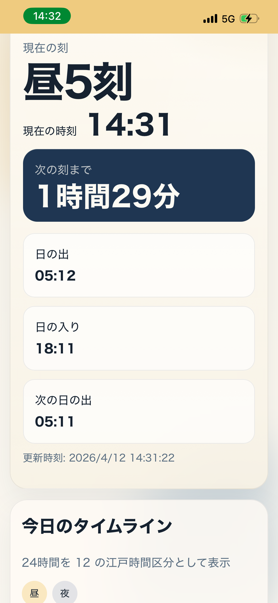
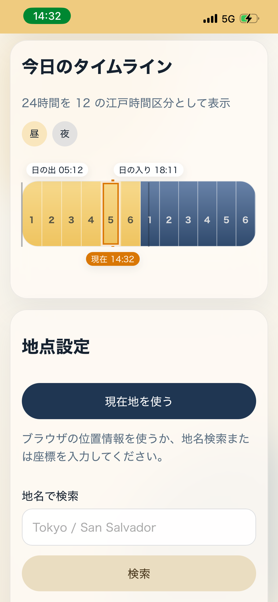

# EdoTime

🌏 **Live Demo**
https://edotime-web.pages.dev/

## Overview

EdoTime is a responsive PWA web app that visualizes traditional Japanese Edo-period temporal time based on sunrise and sunset at any selected location.

Unlike modern fixed-hour systems, Edo time divides day and night into six equal parts, so the length of each “hour” changes depending on the season and location.

Inspired by how people in the Edo period experienced time differently from modern fixed hours.

## Features

* Browser geolocation with manual coordinate fallback
* Place search via Open-Meteo geocoding
* Timezone-aware sunrise/sunset lookup
* Current Edo segment and real-time countdown
* 12-segment timeline visualization
* Japanese and English UI
* Offline fallback using cached data
* Basic PWA support (manifest + service worker)

## Screenshot




## Tech Stack

* React 19
* TypeScript
* Vite
* Vitest

## Development

```bash
npm install
npm run dev
```

## Test

```bash
npm test
```

## Build

```bash
npm run build
```

## Deployment

This is a static client-side app and can be deployed to:

* Cloudflare Pages
* GitHub Pages

## Notes

* Solar times and timezone detection use Open-Meteo APIs
* Reverse geocoding uses OpenStreetMap Nominatim
* When offline, the app falls back to the latest cached result if available

## Concept

Edo time divides day and night into six equal parts based on sunrise and sunset, so the length of “hours” changes every day.

## License

MIT License

Copyright (c) 2026 Rieko Sakai

Permission is hereby granted, free of charge, to any person obtaining a copy...
